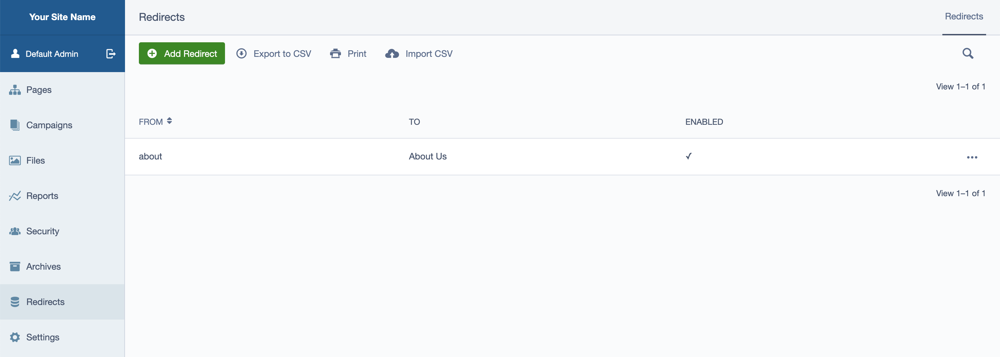
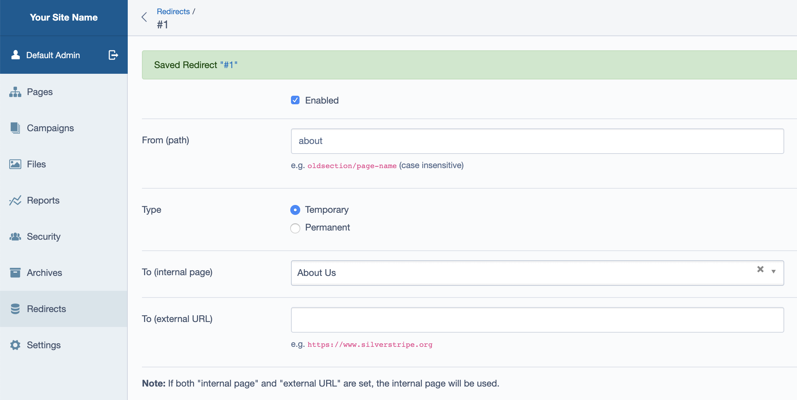

# Redirect Middleware

Very lightweight middleware for Silverstripe CMS 4 to redirect (either 301 or 302) from specified paths to pages/URLs.

## Installation

1. `composer require edgarindustries/silverstripe-redirectmiddleware`
2. Run /dev/build

## Usage

Browse to the Redirects tab in admin.

Adding/editing redirects is simple:

